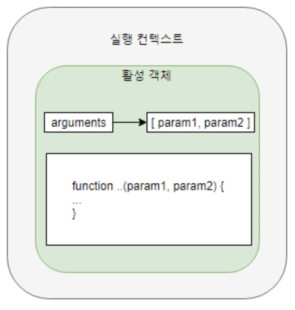
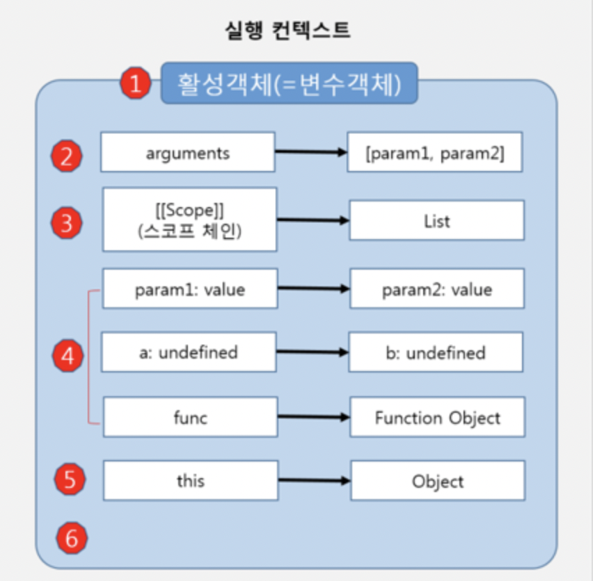

## 실행컨텍스트의 개념
- 실행 가능한 자바스크립트 코드 블록이 실행되는 환경(대부분 함수임)
- 현재 실행되는 컨텍스트에서 이 컨텍스트와 관련 없는 실행코드가 실행되면,  
새로운 컨텍스트가 생성되어 스택에 들어가고 제어권이 그 컨텍스트로 이동한다.



 console.log("hi this is global context");
 
 function Excontext1() {
   console.log("This is ExContext1!");
 }
 function Excontext2() {
   console.log("This is Excontext2!");
 }


//새로운 함수 호출이 발생하면 새로운 컨텍스트가 만들어 지고 실행되며, 종료되면 반환된다.

[실행 컨텍스트가 형성되는 경우]
1. 전역코드
2. eval()함수로 실행되는 코드
3. 함수안의 코드를 실행할 경우 

## 실행컨텍스트 생성과정

### 1. 활성 객체와 변수 객체


function execute(param1, param2) {
  let a = 1, let b = 2;
  function fun(){
    return a+b;
  }
  return param1 + param2 + func();
}
execute(3, 4);



#### 1.1 활성 객체 생성
- 실행컨텍스트가 생성되면 자바스크립트 엔진은 해당 컨텍스트에서 실행에 필요한   여러가지 정보를 담을 객체를 생성함 이를 활성객체라 한다. 
이 객체에 앞으로 사용하게 될 매개변수나 사용자가 정의한 변수및 객체를 저장하고 새로만들어진 컨텍스트로 접근 가능하게 되어있다.
#### 1.2 arguments객체 생성
- 앞서 만들어진 활성객체는 arguments프로퍼티로 이 arguments객체를 참조함.

;
* execute() 함수의 param1과 param2가 들어왔을경우 활성 객체의 상태를 표현함.

#### 1.3 스코프 정보 생성
- 현재 컨텍스트의 유효 범위를 나타내는 스코프 정보를 생성. 
이 스코프 정보는 현재 실행중인 실행 컨텍스트 안에서 연결리스트와 유사한 형식으로 만들어짐.
(현재 컨텍스트에서 특정변수에 접근해야 할 경우, 리스트[스코프체인]를 활용함.)

#### 1.4 변수생성
- 변수객체(=활성객체)
- 변수 객체 안에서 호출된 함수인자는 각각의 프로퍼티가 만들어 지고 그 값이 할당됨. 만약 값이 넘겨지지 않았다면 undefined가 할당됨.
(위의 예제 execute() 함수안에 정의 된 변수 a,b와 함수 func가 생성됨  단 메모리에 생성,초기화 과정은 변수나 함수에 해당 표현식이 실행되기
전까지는 이루어지지 않음. 따라서 a와 b에는 먼저 undefined가 할당됨)

#### 1.5 this 바인딩
- 마지막 단계에서 this키워드를 사용하는 값이 할당됨.
- this가 참조하는 객체가 없으면 전역 객체를 참조함

#### 1.6 코드 실행
- 하나의 실행 컨텍스트가 생성됨. 변수객체가 만들어진 후에, 코드에 있는 여러가지 표현식 실행이 이루어짐. 
 이렇게 되면서 변수의 초기화 및 연산, 또 다른 함수 실행등이 이루어짐. 그래서 a와 b에도 1,2이 각각 할당됨.
;

* 전역 실행 컨텍스트는 arguments객체가 없으며, 전역 객체 하나만을 포함하는 스코프 체인이 있음.이를 전역실행 컨텍스트라함.

# 컨텍스트 원칙
1. 전역 컨텍스트 하나 생성후 함수 호출시 마다 컨텍스트가 생김
2. 컨텍스트 생성 시 컨텍스트 안에 변수객체, 스코프체인, this가 생성됨
3. 컨텍스트 생성 후 함수가 실행되는데, 사용되는 변수들은 변수 객체안에서 값을 찾고, 없으면 스코프 체인을 따라가면 찾음
4. 함수 실행이 마무리 되면 해당 컨텍스트는 사라짐.