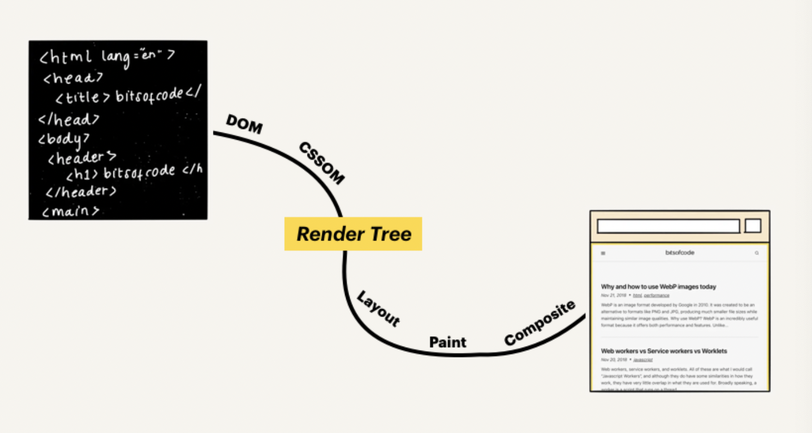
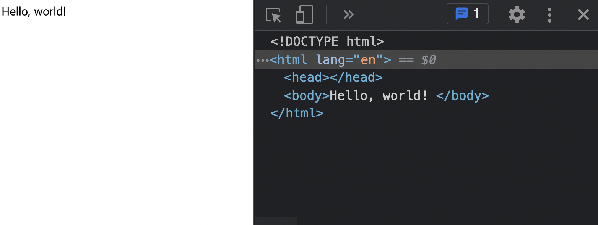

자바스크립트 입장에서 html은 문자열 그이상 그이하도 아님.
문자열 자체에는 정보가 그닥 없음.(slice, length정도..문자열이기 때문에)
좀더 유용하게 자바스크립트가 알아먹을수 있도록 변경해야했었는데 이게 바로 DOM이다.
(html을 자바스크립트가 이해할수있는 object의 형태로 바꾼것)
app.js를 보면 일년의 html코드를 최소한의 의미가 있는 단위로 쪼갯어야했고 이것을
노드로 쪼갠다.

## DOM이란?
- DOM(Document Object Model) 은 웹페이지에 대한 인터페이스이다.
기본적으로 여러프로그램들이 페이지의 콘텐츠 및 구조, 그리고 스타일을 읽고 조작할 수있도록 API를 제공함.

### 웹페이지 생성과정
- 웹 브라우저가 원본 HTML 문서를 읽어들인 후, 스타일을 입히고 대화형 페이지로 만들어 뷰 포트에 표시하기까지의 과정을 "Critical Rendering Path" 라고함. 

1. 브라우저는 읽어들인 문서를 파싱하여 최종적으로 어떤 내용을 페이지에 렌더링할지 결정한다.
2. 브라우저는 해당 렌더링을 수행한다.

;

- 첫번째 과정을 거치면 "렌더 트리"가 생성됨.
- 렌더 트리는 웹 페이지에 표시될 HTML 요소들과 이와 관련된 스타일 요소들로 구성됨.<br/>
브라우저는 렌더 트리를 생성하기 위해 다음과 같이 두모델이 필요하다.

* DOM(Document Object Model) - HTML 요소들의 구조화된 표현
* CSSOM(Cascading Style Sheets Object Model) - 요소들과 연관된 스타일 정보의 구조화된 표현

### DOM의 생성
- dom은 단순 텍스트 구성된 HTMl 문서의 내용과 구조가 객체 모델로 변환되어 다양한 프로그램에서 사용될 수 있다는 점이다.




<html lang ="en">
  <head>
    <title>My first web page </title>
  </head>
  <body>
    <h1>Hello world! </h1>
    <p>how are you? </p>
  </body>
</html>



;

- dom의 개체 구조는 "노드 트리" 로 표현된다. 
하나의 부모 줄기가 여러개의 자식 나무가지를 가지고 있고 
또 각각의 나뭇가지는 잎들을 가질수 있는 구조이다.
위의 구조는 <html>은 부모줄기 루트 요소에 내포된 태그들은 자식 나뭇가지 그리고 요소안에 컨텐츠는 잎에 해당함

### DOM이 아닌것
1. DOM은 HTML이 아니다.
- DOM은 HTML 문서로부터 생성되지만 항상 동일하지 않다. 

1-1. 작성된 HTML 문서가 유효하지 않을때

```javascript
  <!doctype html>
  <html>
    Hello, world!!
  </html>
```
;

- 문서에 유효한 HTML규칙의 필수사항인 <head>와 <body> 요소가 빠져있으나 생성된 DOM트리에는 올바르게 교정되어 나타남

1-2. 자바스크립트에 의해 DOM이 수정될때
```javascript
  let newParagraph = document.createElement("p");
  let paragraphContent = document.createTextNode("I'm new!");
  newParagraph.appendChild(paragraphContent);
  document.body.appendChild(newParagraph);
```
- 해당코드는 DOM을 업데이트함. 하지만 HTML 문서의 내용을 변경하진 않음.


2. DOM은 브라우저에서 보이는 것이 아님.
- 브라우저 뷰 포트에 보이는 것은 렌더 트리로 DOM과 CSSOM의 조합이다.

```javascript
  <!doctype html>
  <html lang="en">
    <head></head>
    <body>
      <h1>Hello,world!</h1>
      <p style="display: none;">How are you?</p>
    </body>
  </html>
```
- DOM은 <p> 요소를 포함시킨다<br>
그러나 렌더 트리에 해당하는 뷰포트에 표시되는 내용은 
<p> 요소를 포함하지 않는다.

요약 정리
- DOM은 HTML문서에 대한 인터페이스이다.
- 첫째로 뷰포트에 무엇을 렌더링 할지 결정하기 위해 사용됨.
- 둘째로는 페이지의 콘텐츠 및 구조, 그리고 스타일이 자바스크립트 프로그램에 의해 수정되기 위해 사용됨.