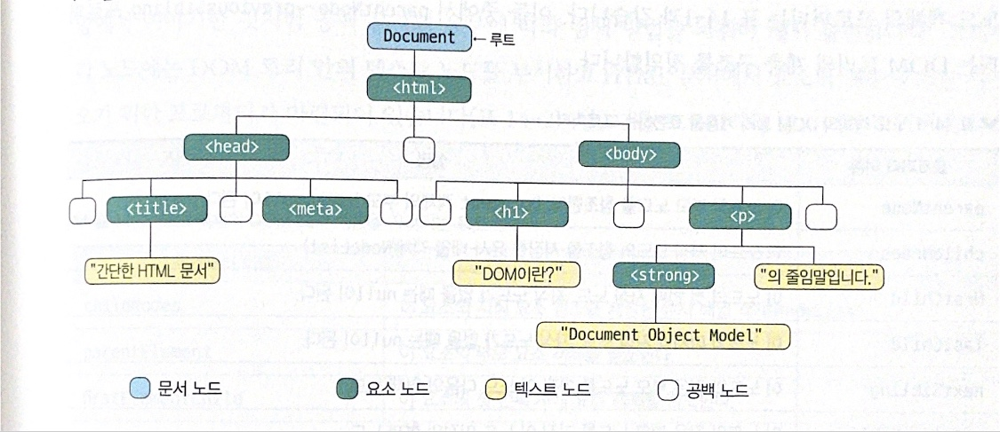

## DOM트리
```javascript
  <!DOCTYPE html>
  <html lang="ko">
    <head>
      <title>간단한 문서</title>
      <meta charset="UTF-8">
    </head>
    <body>
      <h1>DOM이란?</h1>
      <p><strong>Document Object Model</strong>의 줄임말 입니다.</p>
    </body>
  </html>
```
- 웹 브라우저가 HTML문서를 읽어 들이면 document객체로 시작하는 DOM트리가 만들어짐.
DOM트리를 구성하는 객체 하나를 노드(Node)라고 함.

;

### NODE의 종류
- ELEMENT_NODE = 1<br>(tag자체)
  ATTRIBUTE_NODE = 2<br>
  TEXT_NODE = 3<br>
  CDATA_SECTION_NODE = 4<br>
  ENTITY_REFERENCE_NODE = 5<br>
  ENTITY_NODE = 6<br>
  PROCESSING_INSTRUCTION_NODE = 7<br>
  COMMENT_NODE = 8<br>
  DOCUMENT_NODE = 9<br>
  DOCUMENT_TYPE_NODE = 10<br>
  DOCUMENT_FRAGMENT_NODE = 11<br>
  NOTATION_NODE = 12<br>
  DOCUMENT_POSITITION_DISCONNECTED = 1<br>

노드는 세종류의 노드가 기본적이다.
- 문서노드: 전체 문서를 가리키는 Document 객체, document로 참조할 수 있다.
- HTML 요소 노드: HTML요소를 가리키는 객체(이 절에서는 요소 객체로 줄여서 부름)
- 텍스트 노드: 텍스트를 가리키는 객체(이 절에서는 텍스트 객체로 줄여서 부름)

* HTML은 요소 뒤에 공백문자(공백 문자, 탭문자,줄바꿈 문자 등) 가 여러개 있어도 무사함.<br>
그러나 DOM 트리는 요소 앞뒤에서 연속적인 공백 문자를 발견하면 텍스트로 취급하여 텍스트 노드로 생성함.<br>
이렇게 공백 문자만으로 구성된 텍스트 노드를 공백노드라고 함.(단 html요소 안에 있는 첫 공백 문자와 마지막 공백 문제아 대해서는 공백노드를 생성하지 않음)

```javascript
  <!DOCTYPE html>
<html lang="en">
<head>
  <meta charset="UTF-8">
  <meta http-equiv="X-UA-Compatible" content="IE=edge">
  <meta name="viewport" content="width=device-width, initial-scale=1.0">
  <title>Document</title>
</head>
<body>
  <div class="parent">
    <!-- COMMENT -->
    <!-- Another comment-->
    <div>child 1</div>
    <div>child 2</div>
    <div>child 3</div>
  </div>
</body>
</html>

const parent = document.querySelector('.parent');
parent;

```